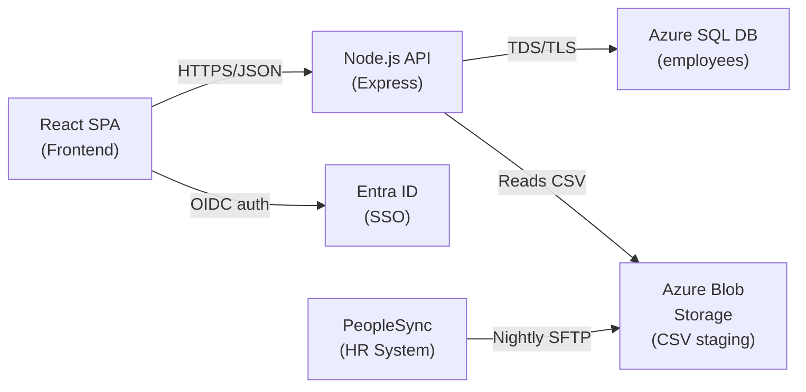
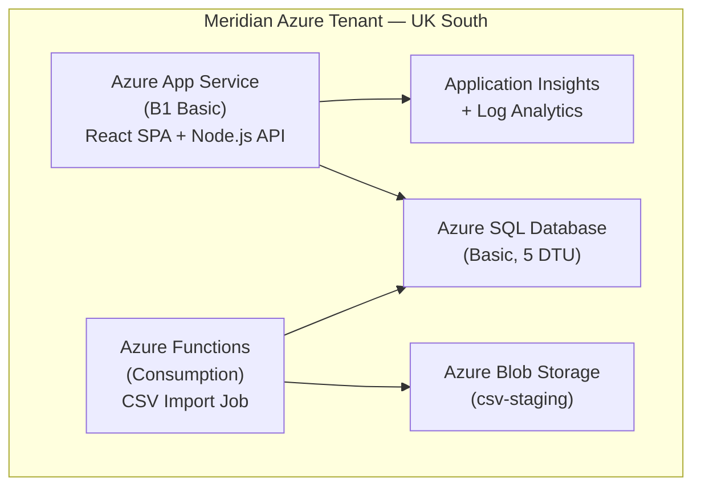

<h4>About This Example</h4>

This is a **fictional but realistic** Solution Architecture Document for an internal employee directory at Meridian Financial Services. It demonstrates the ADS standard at **Recommended** documentation depth, appropriate for a straightforward Tier 4 internal application heading to production.

Use this as a reference when completing your own SAD. The structure, field names, and enum values follow the standard exactly.

---

## 0. Document Control

### 0.1 Document Metadata

| Field | Value |
|-------|-------|
| **Document Title** | Solution Architecture Document -- Employee Directory |
| **Application / Solution Name** | Employee Directory |
| **Application ID** | APP-0347 |
| **Author(s)** | Sarah Chen, Solution Architect |
| **Owner** | Sarah Chen, Solution Architect |
| **Version** | 1.0 |
| **Status** | Approved |
| **Created Date** | 2025-09-15 |
| **Last Updated** | 2025-11-20 |
| **Classification** | Internal |

### 0.2 Change History

| Version | Date | Author / Editor | Description of Change |
|---------|------|-----------------|----------------------|
| 0.1 | 2025-09-15 | Sarah Chen | Initial draft |
| 0.2 | 2025-10-01 | Sarah Chen | Incorporated feedback from security review |
| 0.3 | 2025-10-22 | Sarah Chen | Added data view and integration details following HR team workshop |
| 1.0 | 2025-11-20 | Sarah Chen | Approved by Architecture Review Board |

### 0.3 Contributors & Approvals

| Name | Role | Contribution Type |
|------|------|------------------|
| Sarah Chen | Solution Architect | Author |
| David Okoro | IT Operations Lead | Reviewer |
| Priya Sharma | HR Systems Manager | Reviewer |
| James Whitfield | Information Security Analyst | Reviewer |
| Architecture Review Board | Governance | Approver |

### 0.4 Document Purpose & Scope

This SAD describes the architecture of the Employee Directory application, a simple internal web application that allows Meridian Financial Services staff to look up colleague contact details and organisational information.

- **Scope boundary:** The Employee Directory application, its API, database, and integration with the corporate HR system and Entra ID.
- **Out of scope:** The HR system itself (documented separately under APP-0112), corporate network infrastructure, and the Entra ID tenant configuration.
- **Related documents:** HR System SAD (APP-0112), Meridian Cloud Platform Standards (STD-0023), Information Security Policy (POL-0008).

---

## 1. Executive Summary

### 1.1 Solution Overview

The Employee Directory is an internal web application that enables Meridian Financial Services employees to search for and view colleague contact information, including name, department, job title, telephone number, email address, office location, and photograph. It replaces a manually maintained Excel spreadsheet that has become unreliable, difficult to search, and frequently out of date.

The application uses a React single-page application frontend served from Azure App Service, backed by a Node.js REST API and an Azure SQL database. Employee records are synchronised nightly from the corporate HR system via an automated CSV import.

### 1.2 Business Context & Drivers

| Driver | Description | Priority |
|--------|------------|----------|
| Data accuracy | The current spreadsheet is frequently out of date; leavers remain listed and new starters are missing for weeks | High |
| Searchability | Finding colleagues across 450 staff using a spreadsheet is slow and frustrating | High |
| Self-service | HR spend approximately 3 hours per week answering basic "who is..." queries | Medium |
| Compliance | The spreadsheet lacks access controls and audit logging; this is a minor data protection concern | Medium |

### 1.3 Strategic Alignment

#### Organisational Strategy Alignment

| Question | Response |
|----------|----------|
| Which organisational strategy or initiative does this solution support? | Cloud-first strategy and digital workplace programme |
| Has this solution been reviewed against the organisation's capability model? | Yes |
| Does this solution duplicate any existing capability? | No -- the SharePoint spreadsheet is being retired, not duplicated |

#### Reuse of Shared Services & Platforms

| Capability | Shared Service / Platform | Reused? | Justification (if not reused) |
|-----------|--------------------------|---------|------------------------------|
| Identity & Access | Entra ID (corporate tenant) | Yes | -- |
| Messaging / Notifications | N/A | N/A | No notification capability required |
| API Management | N/A | N/A | Single internal API; API gateway unnecessary at this scale |
| Monitoring & Logging | Azure Monitor + Log Analytics | Yes | -- |
| Data & Analytics | N/A | N/A | No analytics requirements |
| CI/CD | GitHub Actions (corporate organisation) | Yes | -- |

### 1.4 Scope

#### In Scope

- Employee Directory web application (frontend and API)
- Azure SQL database for employee records
- Nightly data feed from the Meridian HR system (PeopleSync)
- Entra ID integration for single sign-on
- Production and development environments
- All internal employees as end users

#### Out of Scope

- Changes to the HR system (PeopleSync) itself
- Organisational chart or reporting-line visualisation (potential future phase)
- Mobile-native application (the web application is responsive and works on mobile browsers)
- External access (VPN required for remote workers; this is existing infrastructure)
- Self-service profile editing by employees (all changes are made by HR in the source system)

### 1.5 Current State / As-Is Architecture

The current employee directory is a shared Excel spreadsheet stored on a SharePoint Online site within the HR team's document library. Key limitations:

- **Manual updates:** HR staff manually edit the spreadsheet when employees join, leave, or change roles. Updates are often delayed by days or weeks.
- **No access control:** All employees with access to the HR SharePoint site can view and edit the spreadsheet. There is no separation between read and write access.
- **Poor searchability:** Users must open the file and use Excel's find function. There is no structured search, filtering, or browsing.
- **No audit trail:** Changes to the spreadsheet are not logged beyond SharePoint's basic version history.
- **No photographs:** The spreadsheet contains text data only; employees cannot look up colleagues by face.

The new application will completely replace this spreadsheet, which will be archived and removed from active use after a 4-week parallel running period.

### 1.6 Key Decisions & Constraints

| Decision / Constraint | Rationale | Impact |
|----------------------|-----------|--------|
| Azure App Service (PaaS) over on-premises IIS | Aligns with cloud-first strategy; reduces operational overhead; eliminates need for server patching | Application is deployed as a PaaS web app with no VM management |
| Azure SQL over Cosmos DB | Relational data model suits structured employee records; team has strong SQL skills; Cosmos DB's global distribution is unnecessary for a single-region internal app | Simple relational schema; familiar tooling; lower cost |
| Nightly CSV import over real-time API integration | PeopleSync (HR system) does not expose a real-time API; CSV export is the only supported integration method | Employee data may be up to 24 hours stale; accepted by HR as sufficient |
| Must use Azure | Organisational constraint: all new applications must be hosted on the Meridian Azure tenant | Limits technology choices to Azure services |

### 1.7 Project Details

| Field | Value |
|-------|-------|
| **Project Name** | Employee Directory Replacement |
| **Project Code / ID** | PRJ-2025-089 |
| **Project Manager** | Ravi Patel |
| **Estimated Solution Cost (Capex)** | GBP 18,000 (development) |
| **Estimated Solution Cost (Opex)** | GBP 2,400/year (Azure hosting) |
| **Target Go-Live Date** | 2026-02-01 |

### 1.8 Business Criticality

Selected criticality: **Tier 4: Low Impact**

The Employee Directory is a convenience tool. If the service is unavailable, employees can contact colleagues through Outlook (which has its own global address list for email and phone), Microsoft Teams, or by asking their manager. There is no revenue, regulatory, or safety impact from downtime.

---

## 2. Stakeholders & Concerns

### 2.1 Stakeholder Register

| Stakeholder | Role / Group | Key Concerns | Relevant Views |
|-------------|-------------|--------------|----------------|
| Priya Sharma | HR Systems Manager (Business Owner) | Data accuracy, ease of use, reduction in manual queries | Executive Summary, Data View |
| Sarah Chen | Solution Architect | Design integrity, standards compliance, maintainability | All views |
| James Whitfield | Information Security Analyst | Data protection, access control, authentication | Security View, Data View |
| David Okoro | IT Operations Lead | Deployment, monitoring, support burden | Physical View, Operational Excellence, Lifecycle |
| Tom Bradley | Development Lead | Technology stack, build pipeline, code maintainability | Logical View, Lifecycle |
| All Employees (c.450) | End Users | Fast search, up-to-date information, usability | Executive Summary, Scenarios |
| HR Team (8 staff) | Data Maintainers | Admin interface for corrections, photo uploads | Scenarios, Logical View |

### 2.2 Concerns Matrix

| Concern | Stakeholder(s) | Addressed In |
|---------|---------------|-------------|
| Employee data is accurate and current | HR Systems Manager, End Users | 3.2 Integration & Data Flow, 3.4 Data View |
| Application is secure and access-controlled | Information Security Analyst | 3.5 Security View |
| Application is simple to operate and support | IT Operations Lead | 4.1 Operational Excellence, 5. Lifecycle |
| Application is cost-effective for a Tier 4 system | HR Systems Manager, IT Operations Lead | 4.4 Cost Optimisation |
| Data protection requirements are met | Information Security Analyst, HR Systems Manager | 3.4 Data View, 3.5 Security View |
| Search is fast and intuitive | End Users | 3.6 Scenarios, 4.3 Performance |

### 2.3 Compliance & Regulatory Context

#### Regulatory Requirements

| Regulation / Standard | Applicability | Impact on Design |
|----------------------|--------------|-----------------|
| UK GDPR | Employee personal data (names, contact details, photographs) is processed | Data classification, retention policy, access controls, and privacy notice required |
| Data Protection Act 2018 | UK domestic implementation of GDPR | Covered by GDPR controls above |

#### Regulated Activities

- No -- the Employee Directory does not support any FCA-regulated activities. It is an internal staff tool only.

#### Compliance Standards

| Standard | Version | Applicability |
|----------|---------|--------------|
| Meridian Information Security Policy (POL-0008) | 3.1 | Authentication, access control, encryption, logging |
| Meridian Cloud Platform Standards (STD-0023) | 2.0 | Azure resource naming, tagging, region selection |

---

## 3. Architectural Views

### 3.1 Logical View

#### 3.1.1 Application Architecture Diagram

#### 3.1.2 Component Decomposition

| Component | Type | Description | Technology | Owner |
|-----------|------|-------------|------------|-------|
| Employee Directory Frontend | Application | Single-page application providing search, browse, and admin UI | React 18, TypeScript, Vite | Development Team |
| Employee Directory API | Service | REST API serving employee data and handling admin operations | Node.js 20 LTS, Express, TypeScript | Development Team |
| Employee Database | Database | Relational store for employee records and photographs | Azure SQL Database (Basic tier, 5 DTU) | IT Operations |
| CSV Staging Store | Storage | Blob container receiving nightly HR export files | Azure Blob Storage | IT Operations |
| CSV Import Job | Service | Scheduled function that processes staged CSV files into the database | Node.js script triggered by Azure Functions timer | Development Team |

#### 3.1.3 Service & Capability Mapping

| Service ID | Service Name | Capability ID | Capability Name |
|-----------|-------------|--------------|----------------|
| SVC-0347-01 | Employee Lookup | CAP-HR-004 | Staff Directory |
| SVC-0347-02 | Employee Admin | CAP-HR-005 | Staff Data Maintenance |

#### 3.1.4 Application Impact

| Application Name | Application ID | Impact Type | Change Details | Comments |
|-----------------|---------------|-------------|----------------|----------|
| PeopleSync (HR System) | APP-0112 | Use | Consumes nightly CSV export | No changes required to PeopleSync; existing export capability |
| SharePoint Online | N/A | Retire (partial) | HR team spreadsheet will be archived | Spreadsheet removed after parallel run period |

#### 3.1.6 Technology & Vendor Lock-in Assessment

| Component / Service | Vendor / Technology | Lock-in Level | Mitigation | Portability Notes |
|---|---|---|---|---|
| Azure App Service | Microsoft Azure | Low | Standard Node.js app; can run on any hosting platform | Dockerfile available for portability |
| Azure SQL Database | Microsoft Azure | Low | Standard T-SQL; compatible with SQL Server on any platform | Data exportable via standard tooling (bacpac, CSV) |
| Azure Blob Storage | Microsoft Azure | Low | Standard blob/object storage pattern | Could substitute S3 or any object store |
| Entra ID (OIDC) | Microsoft | Low | Standard OIDC protocol; could switch to any OIDC provider | Application uses standard OIDC libraries (passport.js) |

### 3.2 Integration & Data Flow View

#### 3.2.1 Data Flow Diagrams

**Primary data flow -- Employee Search:**

1. User opens the Employee Directory in their browser.
2. Browser redirects to Entra ID for OIDC authentication; user signs in with corporate credentials.
3. Entra ID returns an ID token and access token to the SPA.
4. User enters a search query in the frontend.
5. Frontend sends an authenticated GET request to the API (`/api/employees?q=...`).
6. API validates the access token, queries Azure SQL, and returns matching employee records as JSON.
7. Frontend renders the search results.

**Secondary data flow -- Nightly HR Import:**

1. PeopleSync (HR system) generates a CSV export of all active employees at 02:00 UTC daily.
2. PeopleSync uploads the CSV file to the Azure Blob Storage staging container via SFTP (managed by Azure Blob Storage SFTP endpoint).
3. At 03:00 UTC, an Azure Functions timer trigger fires the CSV Import Job.
4. The import job reads the CSV from Blob Storage, validates the data, and performs an upsert into Azure SQL.
5. Employees no longer present in the CSV are soft-deleted (marked as inactive, not removed).
6. The import job logs the result (rows processed, errors) to Application Insights.

#### 3.2.2 Internal Component Connectivity

| Source Component | Destination Component | Protocol / Encryption | Authentication Method | Purpose |
|-----------------|----------------------|----------------------|----------------------|---------|
| React SPA | Node.js API | HTTPS / TLS 1.2 | Bearer token (Entra ID JWT) | Employee search and admin operations |
| Node.js API | Azure SQL Database | TDS / TLS 1.2 | Managed Identity (Entra ID) | Read/write employee records |
| CSV Import Job | Azure Blob Storage | HTTPS / TLS 1.2 | Managed Identity (Entra ID) | Read staged CSV files |
| CSV Import Job | Azure SQL Database | TDS / TLS 1.2 | Managed Identity (Entra ID) | Upsert employee records |

#### 3.2.3 External Integration Architecture

| Source Application | Destination Application | Protocol / Encryption | Authentication | Security Proxy | Purpose |
|-------------------|------------------------|----------------------|---------------|---------------|---------|
| PeopleSync (APP-0112) | Azure Blob Storage (CSV staging) | SFTP / SSH | SSH key pair | N/A | Nightly employee data export |

##### End User Access

| User Type | Access Method | Authentication | Protocol |
|-----------|-------------|---------------|----------|
| Internal employees | Web browser via corporate network or VPN | Entra ID SSO (OIDC) | HTTPS |
| HR administrators | Same web application with elevated role | Entra ID SSO (OIDC) + RBAC group membership | HTTPS |

### 3.3 Physical View (Infrastructure & Deployment)

#### 3.3.1 Deployment Architecture Diagram

#### 3.3.2 Hosting & Infrastructure

##### Hosting Venues

| Attribute | Selection |
|-----------|----------|
| **Hosting Venue Type** | Cloud |
| **Hosting Region(s)** | UK (Azure UK South) |
| **Service Model** | PaaS |
| **Cloud Provider** | Azure |
| **Account / Subscription Type** | Meridian Non-Production & Production subscription (sub-prod-001) |

##### Compute

This solution uses PaaS services exclusively. No virtual machines, containers, or serverless GPU/HPC resources are required.

| Service | SKU / Tier | Details |
|---------|-----------|---------|
| Azure App Service | B1 Basic (1 core, 1.75 GB RAM) | Hosts both the static React SPA and the Node.js API |
| Azure Functions | Consumption plan | Runs the nightly CSV import job only; zero cost when idle |

##### Security Agents

Not applicable -- PaaS services are fully managed by Microsoft. No OS-level agents are required.

#### 3.3.3 Network Topology & Connectivity

##### Connectivity Summary

| Question | Response |
|----------|----------|
| Is this an Internet-facing application? | No -- internal only, accessible via corporate network and VPN |
| Outbound Internet connectivity required? | Yes -- for Entra ID authentication endpoints (login.microsoftonline.com) |
| Cloud-to-on-premises connectivity required? | Yes -- PeopleSync uploads CSV via SFTP from the on-premises data centre |
| Wireless networking required? | No |
| Third-party / co-location connectivity required? | No |
| Cloud network peering required? | No |

##### User & Administrator Access

| Attribute | Selection |
|-----------|----------|
| **User access method** | Web (HTTPS) |
| **User locations** | UK offices, Remote (VPN) |
| **Administrator access method** | Same web application (admin role) |
| **VPN required** | Yes (for remote access; existing corporate VPN) |
| **Direct Connect / ExpressRoute** | Yes (existing ExpressRoute for on-premises to Azure connectivity, used by PeopleSync SFTP) |

##### Transport Protocols

| Protocol | Used? | Purpose |
|----------|-------|---------|
| HTTPS (TLS 1.2+) | Yes | All user and API traffic |
| SFTP | Yes | PeopleSync CSV file upload to Blob Storage |
| ODBC / JDBC | No | -- |
| TCP (other) | No | -- |
| gRPC | No | -- |
| WebSocket | No | -- |

#### 3.3.4 Environments

| Environment | Description | Count & Venue | Compute Solution |
|------------|-------------|--------------|-----------------|
| Development | Local development with shared Azure SQL dev database | 1x Azure (UK South) | App Service B1 Basic |
| Production | Live service environment | 1x Azure (UK South) | App Service B1 Basic |

No staging, pre-production, or DR environments are provisioned. This is appropriate for a Tier 4 application with no DR requirement. Deployments are validated in the development environment before promoting to production.

### 3.4 Data View

#### 3.4.1 Data Architecture & Storage

##### Data Footprint

| Data Name | Store Technology | Authoritative? | Retention Period | Data Size | Classification | Personal Data? | Encryption Level | Key Management |
|-----------|-----------------|---------------|-----------------|-----------|---------------|---------------|-----------------|---------------|
| Employee records | Azure SQL Database | No (PeopleSync is authoritative) | 7 years from last update (soft-deleted records retained) | < 500 MB | Internal | Yes | Storage | Microsoft-managed (TDE) |
| Employee photographs | Azure SQL Database (varbinary) | Yes (photos are managed directly in this application) | 7 years from last update | < 2 GB | Internal | Yes | Storage | Microsoft-managed (TDE) |
| CSV staging files | Azure Blob Storage | No (transient copy) | 30 days (auto-deleted by lifecycle policy) | < 10 MB per file | Internal | Yes | Storage | Microsoft-managed (SSE) |
| Application logs | Application Insights (Log Analytics) | Yes | 90 days | < 1 GB | Internal | No (no PII logged) | Storage | Microsoft-managed |

#### 3.4.2 Data Classification

| Classification Level | Data Types | Handling Requirements |
|---------------------|------------|----------------------|
| **Internal / Corporate** | Employee names, department, job title, office location, telephone, email, photograph | Access restricted to authenticated Meridian employees; encrypted at rest and in transit |

No Public, Restricted, or Highly Restricted data is stored by this application. The data set does not include sensitive categories such as salary, performance reviews, disciplinary records, or health information -- these remain exclusively in PeopleSync.

#### 3.4.3 Data Lifecycle

| Stage | Description | Controls |
|-------|-------------|----------|
| **Creation / Ingestion** | Employee records are created in PeopleSync by HR. Data is ingested nightly via CSV import. Photographs are uploaded directly by HR administrators through the admin UI. | CSV validated on import (schema check, mandatory fields). Duplicate detection by employee ID. |
| **Processing** | API reads employee data for search queries. No transformation or aggregation occurs. | Access controlled by Entra ID authentication and RBAC. |
| **Storage** | Data stored in Azure SQL with Transparent Data Encryption (TDE). Blob Storage uses Storage Service Encryption (SSE). | Encryption at rest enabled by default on both services. |
| **Sharing / Transfer** | Data is displayed to authenticated employees via the web UI only. No data exports, APIs for other systems, or bulk downloads are provided. | TLS 1.2 in transit. No data leaves the application boundary. |
| **Archival** | Soft-deleted employee records (leavers) are retained in the database for the retention period. | Retained in same database with inactive flag. |
| **Deletion / Purging** | Records older than 7 years from soft-deletion date are permanently purged by a scheduled job. CSV staging files are auto-deleted after 30 days. | Azure SQL scheduled stored procedure. Blob lifecycle management policy. |

#### 3.4.4 Data Privacy & Protection

##### Privacy Assessments

| Assessment Type | ID | Status | Link |
|----------------|-----|--------|------|
| Data Protection Impact Assessment (DPIA) | DPIA-2025-041 | Complete | Meridian SharePoint / Legal / DPIAs |

The DPIA concluded that the Employee Directory processes a limited set of non-sensitive personal data for a legitimate business purpose. Standard controls (access control, encryption, retention policy) are sufficient. No high risks were identified.

##### Use of Production Data for Testing

| Approach | Selected |
|----------|----------|
| Production data is not used for testing | [x] |

The development environment uses synthetic (fabricated) employee data. No production personal data is copied to non-production environments.

##### Data Integrity

- No -- standard database constraints (primary keys, not-null, foreign keys) and TLS-protected transport are sufficient. No additional integrity controls (e.g., checksums, digital signatures) are required for this data set.

##### Data on End User Devices

- No -- the application does not allow data downloads, offline storage, or local caching of employee records beyond standard browser session caching. No data is persisted to end-user devices.

#### 3.4.5 Data Transfers & Sovereignty

##### Data Transfers to Third Parties

No employee data is transferred to third parties. All data remains within the Meridian Azure tenant in UK South.

##### Data Sovereignty

- Yes -- all data is stored in the Azure UK South region (London). This satisfies Meridian's data residency policy requiring employee personal data to remain within the UK.

### 3.5 Security View

#### 3.5.1 Security Overview & Threat Model

##### Security Context

| Question | Response |
|----------|----------|
| Does the solution support regulated activities? | No |
| Is the solution SaaS or third-party hosted? | No -- hosted on the Meridian Azure tenant |
| Has a third-party risk assessment been completed? | N/A -- no third-party services beyond Microsoft Azure (covered by existing enterprise agreement assessment) |

##### Business Impact Assessment

| Impact Category | Business Impact if Compromised |
|----------------|-------------------------------|
| **Confidentiality** | Low -- employee names, emails, phone numbers, and departments would be exposed. This data is already broadly known internally. Limited external value. |
| **Integrity** | Low -- incorrect directory data would cause inconvenience but no financial or safety impact. HR can correct data within 24 hours via the next CSV import. |
| **Availability** | Low -- employees can use Outlook Global Address List or Teams as alternative lookup methods. |
| **Non-Repudiation** | Low -- no transactions or approvals occur within this application. |

#### 3.5.2 Identity & Access Management

##### Authentication Model -- Internal Users

| Access Type | Role(s) | Destination(s) | Authentication Method | Credential Protection |
|------------|---------|----------------|----------------------|----------------------|
| End Users | Viewer | Web application | Entra ID SSO (OIDC) | Managed by Entra ID (MFA enforced by corporate policy) |
| HR Administrators | Admin | Web application (admin features) | Entra ID SSO (OIDC) | Managed by Entra ID (MFA enforced by corporate policy) |
| Service Accounts | CSV Import Job | Azure SQL, Blob Storage | Managed Identity (system-assigned) | No credentials to manage; Azure-managed |
| Service Accounts | App Service to SQL | Azure SQL | Managed Identity (system-assigned) | No credentials to manage; Azure-managed |

No external users access this application.

##### Authentication Details

| Control | Response |
|---------|----------|
| Does the application use SSO or group-wide authentication? | Yes -- Entra ID SSO via OIDC. All Meridian employees can authenticate. |
| What is the unique identifier for user accounts? | Entra ID Object ID (GUID) |
| What is the authentication flow? | OIDC Authorization Code Flow with PKCE (SPA to Entra ID) |
| How are credentials issued to users? | Managed centrally by Entra ID; no application-specific credentials |
| What are the credential complexity rules? | Governed by Entra ID corporate policy (not application-managed) |
| What are the credential rotation rules? | Governed by Entra ID corporate policy |
| What are the account lockout rules? | Governed by Entra ID corporate policy |
| How can users reset forgotten credentials? | Entra ID self-service password reset (existing corporate process) |

##### Session Management

| Control | Response |
|---------|----------|
| How are sessions established after authentication? | OIDC access token stored in browser memory (not localStorage) |
| How are session tokens protected against misuse? | Tokens are short-lived (1 hour), signed by Entra ID, validated by API on every request |
| What are the session timeout and concurrency limits? | Token expires after 1 hour; user re-authenticates silently via Entra ID refresh. No concurrency limits. |

##### Authorisation Model

| Access Type | Role / Scope | Entitlement Store | Provisioning Process |
|------------|-------------|-------------------|---------------------|
| Business Users (Viewer) | Read-only access to all employee records | Entra ID -- all authenticated employees | Automatic; all Meridian employees have Viewer access by default |
| HR Administrators (Admin) | Read/write access; can update records and upload photographs | Entra ID security group: SG-EmployeeDir-Admins | Manual; HR manager requests via IT service desk |
| Service Accounts | Database read/write for import job | Azure RBAC (Managed Identity) | Provisioned via Infrastructure as Code (Bicep) |

##### Privileged Access

| Account Type | Management Approach |
|-------------|-------------------|
| Azure subscription admin | Managed by Meridian Cloud Platform team; PIM (Privileged Identity Management) with JIT access |
| Application admin (HR Admin role) | Entra ID group membership managed by IT service desk; quarterly recertification by HR manager |

#### 3.5.3 Network Security & Perimeter Protection

| Control | Implementation |
|---------|---------------|
| Network segmentation | App Service has built-in network isolation; Azure SQL firewall allows connections only from the App Service and Azure Functions subnets |
| Ingress filtering | App Service access restricted to corporate network IP ranges (no public Internet access) |
| Egress filtering | Default Azure egress; no sensitive data leaves the application |
| Encryption in transit | TLS 1.2 enforced on all connections (App Service, Azure SQL, Blob Storage) |

#### 3.5.4 Data Protection

##### Encryption at Rest

| Attribute | Detail |
|-----------|--------|
| Encryption deployment level | Storage (platform-managed) |
| Key type | Symmetric |
| Algorithm / cipher / key length | AES-256 |
| Key generation method | Microsoft-managed (Azure platform) |
| Key storage | Microsoft-managed |
| Key rotation schedule | Automatic (Microsoft-managed) |

Customer-managed keys are not required for Internal-classified data per Meridian policy (POL-0008 Section 4.3).

##### Secret & Password Protection

| Attribute | Detail |
|-----------|--------|
| Secret store | No application-level secrets. All authentication uses Managed Identity (passwordless). |
| Secret distribution | N/A |
| Secret protection on host | N/A |
| Secret rotation | N/A |

The use of Managed Identity for all service-to-service authentication eliminates the need for stored secrets, connection strings, or API keys.

#### 3.5.5 Security Monitoring & Threat Detection

| Capability | Implementation |
|-----------|---------------|
| Security event logging | Authentication events logged by Entra ID; API access logged by Application Insights |
| SIEM integration | Entra ID sign-in logs flow to corporate Sentinel workspace (existing configuration) |
| Infrastructure event detection | Azure Monitor alerts for Azure SQL and App Service health |
| Security alerting | Failed authentication attempts surface in Entra ID reporting (corporate SOC monitors) |

### 3.6 Scenarios

#### 3.6.1 Key Use Cases

**UC-01: Search for an Employee**

| Attribute | Detail |
|-----------|--------|
| **Actor(s)** | Any authenticated Meridian employee (Viewer role) |
| **Trigger** | User needs to find a colleague's contact details |
| **Pre-conditions** | User is authenticated via Entra ID SSO |
| **Main Flow** | 1. User navigates to the Employee Directory URL. 2. Browser completes OIDC authentication silently (or prompts for sign-in). 3. User types a name, department, or job title into the search box. 4. Frontend sends GET /api/employees?q=&#123;query&#125; with bearer token. 5. API validates the token, queries Azure SQL using parameterised search. 6. API returns matching employee records as JSON. 7. Frontend displays results with name, photo, department, phone, and email. 8. User clicks an employee card to view full details. |
| **Post-conditions** | User has the contact information they need |
| **Views Involved** | Logical, Integration & Data Flow, Physical, Security |

**UC-02: HR Administrator Updates an Employee Record**

| Attribute | Detail |
|-----------|--------|
| **Actor(s)** | HR Administrator (Admin role) |
| **Trigger** | An employee's photograph needs updating, or a correction is needed before the next nightly sync |
| **Pre-conditions** | User is authenticated and is a member of the SG-EmployeeDir-Admins Entra ID group |
| **Main Flow** | 1. Admin navigates to the Employee Directory and authenticates. 2. Admin searches for the employee. 3. Admin clicks "Edit" on the employee record (button visible only to Admin role). 4. Admin updates the field(s) or uploads a new photograph. 5. Frontend sends PUT /api/employees/&#123;id&#125; with updated data and bearer token. 6. API verifies the user's Admin role claim in the JWT. 7. API validates the input and updates Azure SQL. 8. API returns the updated record. 9. Frontend confirms the update to the admin. |
| **Post-conditions** | Employee record is updated immediately; change is logged in Application Insights |
| **Views Involved** | Logical, Integration & Data Flow, Physical, Data, Security |

#### 3.6.2 Architecture Decision Records (ADRs)

**ADR-001: Use Azure SQL Database over Azure Cosmos DB**

| Field | Content |
|-------|---------|
| **Status** | Accepted |
| **Date** | 2025-09-22 |
| **Context** | The application needs a database for structured employee records (approximately 500 rows, well-defined relational schema). Two Azure-native database options were considered. |
| **Decision** | Use Azure SQL Database (Basic tier, 5 DTU). |
| **Alternatives Considered** | **Azure Cosmos DB:** Globally distributed NoSQL database. Offers high availability and horizontal scaling, but this application has a single-region, low-volume workload with a relational data model. Cosmos DB's minimum cost (~GBP 20/month for 400 RU/s) exceeds Azure SQL Basic (~GBP 4/month) for this use case, and the team has no Cosmos DB experience. |
| **Consequences** | Positive: Lower cost, simpler operations, team familiarity with T-SQL. Negative: Limited to single-region deployment (acceptable for Tier 4). |
| **Quality Attribute Tradeoffs** | Cost optimisation (positive) and team skills (positive) weighted over global distribution (not required) and horizontal scalability (not required). |

**ADR-002: Nightly CSV Batch Import over Real-Time Integration**

| Field | Content |
|-------|---------|
| **Status** | Accepted |
| **Date** | 2025-09-22 |
| **Context** | Employee data originates in PeopleSync (the HR system). The directory needs to stay in sync with HR data. PeopleSync supports only CSV file export; it does not offer a real-time API or event-based integration. |
| **Decision** | Implement a nightly batch import of the full employee dataset via CSV file transfer to Azure Blob Storage, processed by an Azure Functions timer trigger. |
| **Alternatives Considered** | **Real-time API integration:** Not available from PeopleSync. Would require a custom middleware layer or changes to the HR system, which is out of scope and budget. **Manual data entry:** Rejected as it replicates the existing problem of stale data and manual effort. |
| **Consequences** | Positive: Simple, reliable, uses existing PeopleSync capability. Negative: Data can be up to 24 hours stale. HR stakeholder has accepted this latency as sufficient for a directory. |
| **Quality Attribute Tradeoffs** | Simplicity and cost (positive) over data freshness (acceptable trade-off for Tier 4). |

---

## 4. Quality Attributes

### 4.1 Operational Excellence

#### 4.1.1 Observability -- Logging

| Log Type | Events Logged | Local Storage | Retention Period | Remote Services |
|----------|--------------|--------------|-----------------|----------------|
| Application logs | API requests, errors, authentication events, CSV import results | None (streamed directly) | 90 days | Application Insights (Log Analytics workspace) |
| Data store logs | Azure SQL audit logs (query metrics, failed logins) | Azure SQL built-in | 90 days | Azure Monitor |
| Infrastructure logs | App Service platform logs, deployment logs | Azure platform | 90 days | Azure Monitor |

#### 4.1.2 Observability -- Monitoring & Alerting

##### Operational Alerts

| Alert Category | Trigger Condition | Notification Method | Recipient |
|---------------|-------------------|-------------------|-----------|
| Application errors | API error rate > 5% over 5-minute window | Email | IT Operations team DL |
| CSV import failure | Import job returns non-zero exit code | Email | IT Operations team DL, HR Systems Manager |
| Azure SQL DTU utilisation | DTU usage > 80% sustained for 15 minutes | Email | IT Operations team DL |

##### Monitoring Tools

| Capability | Tool | Coverage |
|-----------|------|----------|
| Application Performance Monitoring | Application Insights | API and frontend |
| Infrastructure Monitoring | Azure Monitor | App Service, Azure SQL, Blob Storage, Functions |
| Log Aggregation | Log Analytics workspace | All application and infrastructure logs |

Distributed tracing is not implemented. The application is a simple monolith with no service-to-service calls that would benefit from trace correlation.

### 4.2 Reliability & Resilience

#### 4.2.1 Geographic Footprint & Disaster Recovery

| Question | Response |
|----------|----------|
| Is the application deployed across multiple hosting venues for continuity? | No -- single region (UK South). Multi-region deployment is not justified for a Tier 4 application. |
| What is the DR strategy? | Backup & Restore. Azure SQL automated backups provide point-in-time restore. No standby environment. |
| Are there data sovereignty requirements affecting geographic choices? | Yes -- UK data residency requirement met by UK South deployment. |

#### 4.2.2 Scalability

##### Application Scalability

| Attribute | Response |
|-----------|----------|
| **Scaling capability** | No dynamic scaling (pre-sized) |
| **Scaling details** | App Service B1 plan is pre-sized for the expected load (c.450 users, low concurrency). If usage significantly increases, the plan can be manually upgraded to a higher tier. Auto-scaling is not configured as the workload does not justify it. |

##### Dependency Scalability

| Attribute | Response |
|-----------|----------|
| **Dependencies adequately sized?** | Yes (confirmed) |
| **Dependency details** | Azure SQL Basic (5 DTU) is adequate for the low query volume. PeopleSync CSV export is a nightly batch with no scaling concern. |

#### 4.2.3 Fault Tolerance

- No -- the application is not designed with explicit fault tolerance patterns (circuit breakers, retry logic, graceful degradation). If the API or database is unavailable, the application will return an error page. This is acceptable for a Tier 4 system where alternative lookup methods exist (Outlook GAL, Teams).

#### 4.2.4 Failure Modes & Recovery Behaviour

| Component / Dependency | Failure Mode | Detection Method | Recovery Behaviour | User Impact |
|----------------------|-------------|-----------------|-------------------|-------------|
| Azure App Service | Platform outage | Azure Monitor alert | Automatic recovery by Azure platform; if prolonged, raise Azure support ticket | Full outage; users fall back to Outlook GAL |
| Azure SQL Database | Database unavailable | Application error logging; Azure Monitor | Azure platform auto-recovery; point-in-time restore if data corruption | Full outage during recovery |
| CSV Import Job | Import fails (bad data, timeout) | Import job error logging; email alert | IT Operations investigates; re-run manually if needed. Directory data remains stale until next successful import. | No user-facing impact (data is stale but application remains available) |
| Entra ID | Identity provider outage | Corporate SOC monitoring | Dependent on Microsoft restoration; no local mitigation | Users cannot authenticate; full outage |

#### 4.2.5 Backup & Recovery

##### Backup Design

| Attribute | Detail |
|-----------|--------|
| Backup strategy | Azure SQL automated backups (full, differential, transaction log) |
| Backup product/service | Azure SQL built-in backup |
| Backup type | Full (weekly) + Differential (daily) + Transaction log (every 5-10 minutes) |
| Backup frequency | Automated by Azure (see above) |
| Backup retention | 7 days (Azure SQL Basic default) |

##### Backup Protection

| Control | Detail |
|---------|--------|
| Immutability | Azure-managed; backups cannot be modified or deleted by application administrators |
| Encryption | Encrypted at rest (TDE, AES-256) |
| Access control | Restore operations require Azure subscription Contributor role (managed by Cloud Platform team) |

#### 4.2.6 Recovery Scenarios

| # | Scenario | Recovery Approach | RTO | RPO |
|---|----------|------------------|-----|-----|
| 1 | Azure UK South region failure | Wait for Azure recovery. No multi-region failover. Employees use Outlook GAL. | 24 hours (Azure SLA) | 5-10 minutes (transaction log backup) |
| 2 | Azure SQL database corruption | Point-in-time restore from automated backup | 2 hours | 5-10 minutes |
| 3 | Application code defect in production | Rollback to previous deployment via GitHub Actions | 30 minutes | N/A (no data loss) |

### 4.3 Performance Efficiency

#### 4.3.1 Performance Requirements

##### Key Performance Indicators

| Metric | Target | Measurement Method |
|--------|--------|-------------------|
| Response time (P95) | < 500ms for search queries | Application Insights request duration |
| Concurrent users | Up to 50 simultaneous (estimated peak) | Application Insights user sessions |

Performance testing is not formally conducted. The application serves fewer than 450 users with a low-frequency lookup pattern. Basic load validation will be performed during development using manual browser testing and Application Insights monitoring during the parallel run period.

##### Capacity & Growth Projections

| Metric | Current | 1 Year | 3 Years | 5 Years |
|--------|---------|--------|---------|---------|
| Users (total) | 450 | 500 | 550 | 600 |
| Concurrent users (peak) | 20 | 25 | 30 | 40 |
| Data volume | 200 MB | 250 MB | 350 MB | 500 MB |

| Question | Response |
|----------|----------|
| Will the current design scale to accommodate projected growth? | Yes -- Azure SQL Basic and App Service B1 have significant headroom for this workload. |
| Are there known seasonal or cyclical demand patterns? | No -- directory usage is broadly constant throughout the year. |

### 4.4 Cost Optimisation

#### 4.4.1 Cost Influence & Analysis

##### Design Cost Decisions

| Posture | Selected | Detail |
|---------|----------|--------|
| Most cost-effective options selected | [x] | PaaS services at their lowest tiers were deliberately chosen to minimise cost for a Tier 4 system. Azure SQL Basic (GBP 4/month), App Service B1 (GBP 10/month), Functions Consumption (pay-per-execution, effectively free for one daily run), Blob Storage (negligible for < 10 MB). |

##### Cost Analysis

- Yes -- cost was estimated using the Azure Pricing Calculator. The estimated monthly run cost is approximately GBP 200 (including all services, monitoring, and bandwidth). This was reviewed and approved by the project sponsor as proportionate for the business value delivered.

#### 4.4.2 Cost Implications

- No -- the design fully meets requirements. Cost has not constrained the design in any way; the requirements are inherently modest and low-cost Azure services satisfy them.

### 4.5 Sustainability

#### 4.5.1 Hosting Efficiency

##### Hosting Location

| Question | Response |
|----------|----------|
| Has the hosting location been chosen to reduce environmental impact? | No -- UK South was selected for data residency compliance. However, Azure UK South is powered in part by renewable energy sources as part of Microsoft's sustainability commitments. |
| What is the expected workload demand pattern? | Constant (low, business-hours only) |

##### On-Demand Availability

| Question | Response |
|----------|----------|
| Must the application be available continuously? | No -- the application is used during business hours only, but the cost of running PaaS services 24/7 is lower than the operational complexity of implementing a start/stop schedule. |
| Can the solution be shut down or scaled down during off-peak hours? | Technically possible but not cost-justified. The B1 App Service plan cost is the same whether running or stopped. |
| Are non-production environments configured to downscale or shut down when not in use? | Yes -- the development App Service is set to auto-stop outside business hours (08:00-18:00 weekdays) using an Azure Automation runbook. |

---

## 5. Lifecycle Management

### 5.1 Software Development & CI/CD

#### Development Practices

The application includes internally developed software.

| Attribute | Detail |
|-----------|--------|
| Source control platform | GitHub (Meridian corporate organisation) |
| CI/CD platform | GitHub Actions |
| Build automation | On push to main: lint, test, build React SPA, build Node.js API |
| Deployment automation | On merge to main: deploy to production via GitHub Actions using Azure App Service deployment slots |
| Test automation | Unit tests (Jest) and linting (ESLint) run on every pull request and merge to main |

#### Application Security in Development

| Control | Implementation |
|---------|---------------|
| Security requirements identification | Captured in this SAD (Section 3.5) and reviewed by Information Security |
| Static Application Security Testing (SAST) | GitHub CodeQL (enabled on repository) |
| Dynamic Application Security Testing (DAST) | No -- not justified for a Tier 4 internal application |
| Software Composition Analysis (SCA) | Dependabot (GitHub-native) for dependency vulnerability scanning |
| Container image scanning | N/A -- no containers |
| Secure coding practices | Code review required on all pull requests; OWASP Top 10 awareness training completed by development team |
| Patch management | Dependabot alerts triaged weekly; critical vulnerabilities patched within 5 business days |

### 5.2 Service Transition & Migration

#### Migration Classification (6 R's)

| Classification | Selected? | Description |
|---------------|-----------|-------------|
| **Replace** | Yes | The shared Excel spreadsheet is being replaced entirely with a purpose-built web application |

#### Transition Plan

| Attribute | Detail |
|-----------|--------|
| Deployment strategy | Big Bang (with 4-week parallel run) |
| Data migration mode | One-off (initial full CSV load) then nightly sync |
| Data migration method | CSV import using the same nightly import job |
| Data volume to migrate | < 500 MB |
| End-user cutover approach | One-off -- email announcement to all staff with link to new application |
| External system cutover | N/A |
| Maximum acceptable downtime | Hours (parallel run means the spreadsheet is still available as fallback) |
| Rollback plan | Revert to the SharePoint spreadsheet. HR retain it as a backup for 4 weeks post-go-live. |
| Acceptance criteria | 1. All active employees visible in directory. 2. Search returns correct results. 3. HR can update records. 4. Nightly import completes successfully for 5 consecutive days. |

### 5.3 Test Strategy

| Test Type | Scope | Approach | Environment | Automated? |
|-----------|-------|----------|-------------|-----------|
| Integration testing | API to database; CSV import pipeline | Jest integration tests against development database | Development | Yes |
| Performance testing | Basic load validation | Manual browser testing + Application Insights monitoring during parallel run | Production | No |
| Security testing | Penetration testing | Not planned (Tier 4; SAST and SCA are sufficient per Meridian policy) | -- | N/A |

### 5.4 Release Management

| Attribute | Detail |
|-----------|--------|
| Release frequency | Monthly (or as needed for bug fixes) |
| Release process | Developer raises PR; code review; merge to main triggers automated deployment to production |
| Release validation | Smoke test (manual check of search and admin functions) after each deployment |
| Feature flags / toggles | Not used -- the application is simple enough to deploy features directly |

### 5.5 Operations & Support

| Attribute | Detail |
|-----------|--------|
| Support model | L1: IT Service Desk (password resets, access queries). L2: IT Operations (infrastructure, alerts). L3: Development team (application bugs). |
| Support hours | Business hours (08:00-18:00 weekdays). No out-of-hours support for a Tier 4 system. |
| SLAs | Internal: 99% availability during business hours (measured monthly). No formal SLA with end users. |
| Escalation paths | Service Desk -> IT Operations -> Development Lead -> Solution Architect |

### 5.6 Resourcing & Skills

#### Team Capability Assessment

| Skill Area | Current Level | Action Required |
|-----------|--------------|-----------------|
| Cloud platform (Azure) | Medium | No action; existing team competency sufficient for PaaS services |
| Infrastructure as Code | Low | Bicep templates provided by Solution Architect; IT Ops to maintain |
| CI/CD pipeline management | High | No action; team experienced with GitHub Actions |
| Application technology stack (React, Node.js) | High | No action; primary skills of the development team |
| Database administration (Azure SQL) | Medium | No action; basic administration only required |
| Security & compliance | Medium | No action; standard controls used; security review completed |

#### Operational Readiness

| Question | Response |
|----------|----------|
| Can the team fully operate and support this solution in production? | A: Fully capable |

### 5.8 Maintainability

| Concern | Approach |
|---------|----------|
| Keeping software versions current and supported | Dependabot for dependency updates; Node.js LTS version tracked; React updated with minor versions |
| Hardware lifecycle management | N/A -- fully PaaS |
| Certificate management | Managed by Azure App Service (managed certificates for custom domain) |
| Dependency management | Dependabot raises PRs for outdated or vulnerable dependencies weekly |

### 5.10 Exit Planning

| Attribute | Detail |
|-----------|--------|
| Exit strategy | Application is standard Node.js + React; can be rehosted on any platform supporting Node.js and a SQL database. |
| Data portability | Azure SQL supports standard export formats (bacpac, CSV). Employee data can be extracted at any time. |
| Vendor lock-in assessment | Low -- see Section 3.1.6. No Azure-proprietary APIs or services are used in the application code. |
| Exit timeline estimate | 2-4 weeks to re-deploy on an alternative platform |

---

## 6. Decision Making & Governance

### 6.1 Constraints

| ID | Constraint | Category | Impact on Design | Last Assessed |
|----|-----------|----------|-----------------|---------------|
| C-001 | All new applications must be hosted on the Meridian Azure tenant | Organisational | Limits hosting to Azure services; all technology choices must be Azure-native or Azure-compatible | 2025-09-15 |
| C-002 | Employee data must be sourced from PeopleSync via its existing CSV export capability | Technical | Integration is batch-based (nightly CSV); real-time sync is not possible without changes to PeopleSync (out of scope) | 2025-09-15 |

### 6.2 Assumptions

| ID | Assumption | Impact if False | Certainty | Status | Owner | Evidence |
|----|-----------|----------------|-----------|--------|-------|----------|
| A-001 | PeopleSync CSV export format will remain stable and will not change without notice | CSV import job would fail; data would become stale until the import is updated | High | Closed | Priya Sharma (HR Systems Manager) | Confirmed with PeopleSync vendor that format is contractually stable through 2027 |
| A-002 | The existing ExpressRoute connection between Meridian data centre and Azure UK South has sufficient bandwidth for the nightly CSV upload (< 10 MB) | CSV upload would fail or be slow | High | Closed | David Okoro (IT Operations Lead) | Confirmed; ExpressRoute has 200 Mbps capacity with < 5% utilisation at 02:00 UTC |

### 6.3 Risks

**Risk identification:**

| ID | Risk Event | Category | Severity | Likelihood | Owner |
|----|-----------|----------|----------|-----------|-------|
| R-001 | PeopleSync is replaced or decommissioned, breaking the CSV integration | Technical | Medium | Low | Priya Sharma |
| R-002 | Employee photograph storage exceeds Azure SQL Basic tier limits (2 GB) | Technical | Low | Low | Tom Bradley |

**Risk response:**

| ID | Mitigation Strategy | Mitigation Plan | Residual Risk | Last Assessed |
|----|-------------------|-----------------|--------------|---------------|
| R-001 | Mitigate | The CSV import job is a modular component that can be adapted to a new data source. If PeopleSync is replaced, only the import job needs updating. | Low | 2025-10-01 |
| R-002 | Mitigate | Monitor database size via Azure Monitor alert. If approaching 2 GB, migrate photographs to Azure Blob Storage (estimated 2-day development effort). | Low | 2025-10-01 |

### 6.4 Dependencies

| ID | Dependency | Direction | Status | Owner | Evidence | Last Assessed |
|----|-----------|-----------|--------|-------|----------|---------------|
| D-001 | PeopleSync nightly CSV export must be enabled and running | Inbound | Committed | Priya Sharma | PeopleSync export configured and tested in development | 2025-10-15 |

### 6.5 Issues

No open issues at the time of writing.

### 6.6 Guardrail Exceptions

#### Policy Exceptions

| Question | Response |
|----------|----------|
| Does this design create any exception to current policies and standards? | No |

#### Process Exceptions

| Question | Response |
|----------|----------|
| Does this design create an issue against the process library? | No |

#### Risk Profile Impact

| Question | Response |
|----------|----------|
| Does the design materially change the organisation's technology risk profile? | No |

### 6.7 Architectural Decisions Log

| ADR # | Title | Status | Date | Impact |
|-------|-------|--------|------|--------|
| ADR-001 | Use Azure SQL Database over Azure Cosmos DB | Accepted | 2025-09-22 | Lower cost, simpler operations, team familiarity |
| ADR-002 | Nightly CSV batch import over real-time integration | Accepted | 2025-09-22 | Data up to 24 hours stale; accepted trade-off |

---

## 7. Appendices

### 7.1 Glossary

| Term | Definition |
|------|-----------|
| CSV | Comma-Separated Values -- a plain-text file format for tabular data |
| DTU | Database Transaction Unit -- Azure SQL performance measurement unit |
| Entra ID | Microsoft Entra ID (formerly Azure Active Directory) -- cloud identity and access management service |
| GAL | Global Address List -- the Outlook/Exchange directory of email addresses |
| JWT | JSON Web Token -- a compact token format used in OIDC authentication |
| Managed Identity | An Azure feature that provides Azure services with an automatically managed identity in Entra ID, eliminating the need for credentials |
| OIDC | OpenID Connect -- an authentication protocol built on top of OAuth 2.0 |
| PeopleSync | Meridian's corporate HR system (third-party SaaS product) |
| PKCE | Proof Key for Code Exchange -- a security extension to the OAuth 2.0 authorisation code flow, recommended for SPAs |
| RBAC | Role-Based Access Control -- a method of restricting access based on user roles |
| SPA | Single-Page Application -- a web application that loads a single HTML page and dynamically updates content |
| TDE | Transparent Data Encryption -- Azure SQL feature that encrypts database files at rest |

### 7.2 Reference Documents

| Document | Version | Description | Location |
|----------|---------|-------------|----------|
| HR System SAD (PeopleSync) | 2.1 | Architecture of the corporate HR system | Meridian Confluence / Architecture / APP-0112 |
| Meridian Cloud Platform Standards | 2.0 | Azure naming conventions, tagging, region policy | Meridian Confluence / Standards / STD-0023 |
| Meridian Information Security Policy | 3.1 | Security controls, classification, encryption requirements | Meridian SharePoint / Policies / POL-0008 |
| DPIA -- Employee Directory | 1.0 | Data Protection Impact Assessment | Meridian SharePoint / Legal / DPIAs / DPIA-2025-041 |

### 7.4 Approval Sign-Off

| Role | Name | Date | Signature / Approval Reference |
|------|------|------|-------------------------------|
| Solution Architect | Sarah Chen | 2025-11-18 | ARB-2025-089-SA |
| Information Security | James Whitfield | 2025-11-19 | ARB-2025-089-SEC |
| Architecture Review Board | ARB Panel | 2025-11-20 | ARB-2025-089-APPROVED |

---

## Architecture Compliance Scoring

| Section | Score (0-5) | Assessor | Date | Notes |
|---------|:-----------:|----------|------|-------|
| 1. Executive Summary | 4 | ARB Panel | 2025-11-20 | Clear business context, scope well-defined, strategic alignment demonstrated, criticality justified |
| 3.1 Logical View | 3 | ARB Panel | 2025-11-20 | Components documented with technology choices; vendor lock-in assessed. Design patterns section omitted (monolith -- no complex patterns to document). |
| 3.2 Integration & Data Flow | 4 | ARB Panel | 2025-11-20 | All interfaces documented with protocols and authentication. API contracts not formally versioned (acceptable for single internal consumer). |
| 3.3 Physical View | 3 | ARB Panel | 2025-11-20 | Deployment architecture complete, hosting documented. Bandwidth and latency not quantified (not required at this scale). |
| 3.4 Data View | 4 | ARB Panel | 2025-11-20 | All data stores classified, retention defined, encryption specified, DPIA complete, sovereignty addressed. |
| 3.5 Security View | 4 | ARB Panel | 2025-11-20 | Authentication and authorisation fully documented. Managed Identity eliminates secrets management risk. Formal threat model not produced (proportionate for Tier 4 and low business impact). |
| 3.6 Scenarios | 3 | ARB Panel | 2025-11-20 | Two key use cases documented; two ADRs with rationale and alternatives. Additional use cases (e.g., failure scenario) would improve coverage. |
| 4.1 Operational Excellence | 3 | ARB Panel | 2025-11-20 | Centralised logging and alerting in place. No distributed tracing (not needed). No formal runbooks (proportionate). |
| 4.2 Reliability | 3 | ARB Panel | 2025-11-20 | Backup configured, recovery scenarios documented. No DR or fault tolerance -- appropriate for Tier 4. |
| 4.3 Performance | 3 | ARB Panel | 2025-11-20 | Targets defined, growth projected. No formal performance testing -- acceptable given low concurrency and simple queries. |
| 4.4 Cost Optimisation | 4 | ARB Panel | 2025-11-20 | Cost analysis performed, lowest-cost Azure tiers selected, proportionate to business value. |
| 4.5 Sustainability | 3 | ARB Panel | 2025-11-20 | Non-production auto-shutdown configured. Hosting region chosen for compliance, not carbon. Right-sized PaaS resources. |
| 5. Lifecycle | 3 | ARB Panel | 2025-11-20 | CI/CD documented, migration plan in place, skills assessed. DAST and penetration testing omitted (proportionate). |
| 6. Decision Making | 3 | ARB Panel | 2025-11-20 | Constraints, assumptions, risks, and dependencies documented with ownership. No open issues or guardrail exceptions. |
| **Overall** | **3** | ARB Panel | 2025-11-20 | Solid, proportionate documentation for a Tier 4 internal application at Recommended depth. No critical gaps. Lowest section scores are 3 (meets the minimum for production approval). |

